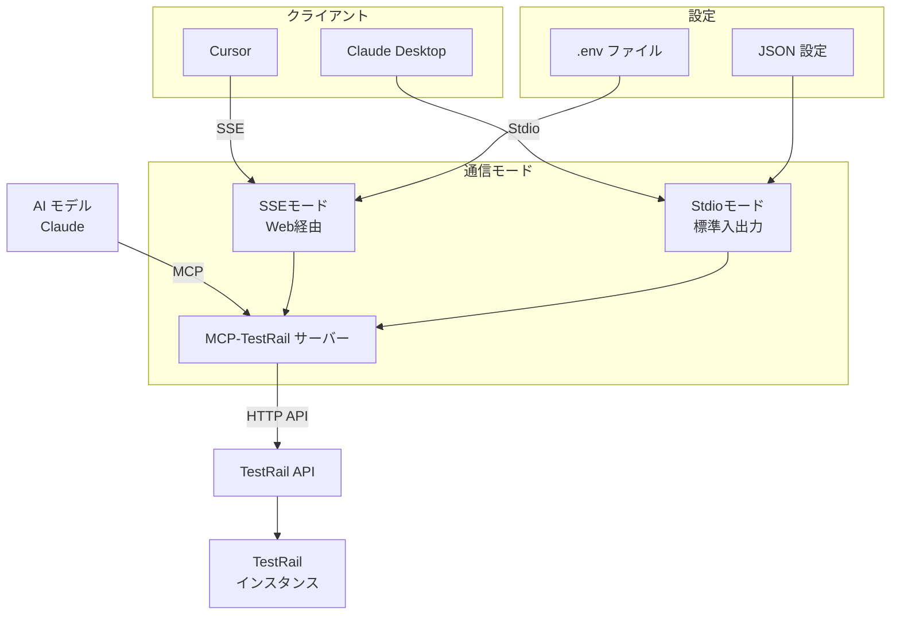

こんにちは。ダイの大冒険ガチ勢の[bun913](https://x.com/bun7623514)と申します。

みなさんはMCPという外部システムやDBとの連携などを標準化するプロトコルをご存知ですか？

https://zenn.dev/cloud_ace/articles/model-context-protocol

私も全然知らなかったのですが、今回自然言語で [TestRail](https://www.testrail.com/) というテストケースやテスト実行結果などのマネジメントツールと連携できるツールを自作してみました。

https://github.com/bun913/mcp-testrail

## デモ

非常に簡単にいうと、Claude Desktop や Cursor のようなツールから自然言語で TestRail に対して操作を実行します。

今の時点で以下のような操作を公開しています。
(4/6 追記: 別途記事にしますがMCPクライアント側のツール数の制限に引っかかっていたため、削減しました)


| Category | Tools |
|----------|-------|
| **Projects** | `getProjects`, `getProject`, `addProject`, `updateProject`, `deleteProject` |
| **Suites** | `getSuites`, `getSuite`, `addSuite`, `updateSuite` |
| **Cases** | `getCase`, `getCases`, `addCase`, `updateCase`, `deleteCase`, `getCaseTypes`, `getCaseFields`, `copyToSection`, `moveToSection`, `getCaseHistory`, `updateCases` |
| **Sections** | `getSection`, `getSections`, `addSection`, `moveSection`, `updateSection`, `deleteSection` |
| **Runs** | `getRuns`, `getRun`, `addRun`, `updateRun`, `closeRun` |
| **Results** | `getResults`, `getResultsForCase`, `getResultsForRun`, `addResultForCase`, `addResultsForCases` |
| **Plans** | `getPlans` |
| **Milestones** | `getMilestones` |
| **Shared Steps** | `getSharedSteps` |

### 期待していること

- シンプルなTestRailの操作
    - プロジェクト情報の詳細説明、既存のソースコードの実装に対して足りないテストケースなどをAIと一緒に考える
    - 考えたテストケースをそのまま自然言語で指示してTestRailに登録する
- 他のMCPサーバーとの連携
    - 例えば [Playwright-MCP](https://github.com/microsoft/playwright-mcp) など連携することで、TestRailにテストケースを準備して、自然言語でテストケースを作成することなどができないか期待しています

### Cursor での実行例

- Projects 一覧の取得


Projectの詳細情報を取得


### Claude Desktop での実行例

TestRail から Project の一覧の取得を指示してみます。


テストケースの追加なども用意しています。私が雑に指示をしているので、色々と必要なリソースを作っています。この辺りはちゃんと指示をしとかないといけませんね。


## 自作MCPサーバーの仕組み

今回作成したMCPサーバーの仕組みは簡単にいうと以下のようなイメージです。



### MCPサーバーとは

MCP（Model Context Protocol）は、AIモデルとツールを連携させるためのプロトコルです。このサーバーは、AIモデルがTestRailのAPIにアクセスして、テスト管理に関連する情報を取得したり操作したりできるようにします。

以下の2種類の通信モードを準備しています。

#### 1. SSEモード（Web経由）

```typescript
// TestRail MCP ServerのSSEエントリーポイント
import { startServer } from "./server/server.js";

// SSEサーバー起動
startServer();
```

https://github.com/bun913/mcp-testrail/blob/60d228a3a299fda881e73d0de7a85fcd0677867f/src/server/server.ts#L49-L87

SSEモードでは、ExpressサーバーがHTTPリクエストを処理し、Server-Sent Events（SSE）を使ってリアルタイム通信を行います。ブラウザやWebアプリケーションからアクセスする際に使用します。

今回の場合 Cursor では SSEモードを利用しています。


#### 2. Stdioモード（標準入出力）

```typescript
// Main execution
const main = async () => {
  try {
    console.error("Starting TestRail MCP Server (stdio mode)...");

    // Create and connect transport
    const transport = new StdioServerTransport();
    await server.connect(transport);

    console.error("TestRail MCP Server connected via stdio");
  } catch (error) {
    console.error("Error starting TestRail MCP Server:", error);
    process.exit(1);
  }
};

// Run the server
main();
```

Stdioモードでは、標準入出力（stdin/stdout）を使って通信します。これはCLI（コマンドラインインターフェース）からサーバーを利用する場合や、他のプログラムと直接連携する場合に便利です。

今回の場合 Claude Desktop では以下のように設定することで、MCPサーバーと連携しています。

```json
{
  "mcpServers": {
    "TestRail": {
      "type": "command",
      "command": "${YOUR_NODE_PATH}/node",
      "args": ["${YOUR_PROJECT_PATH}/mcp-testrail/dist/stdio.js"],
      "env": {
        "TESTRAIL_URL": "https://example.testrail.io",
        "TESTRAIL_USERNAME": "hoge@gmail.com",
        "TESTRAIL_API_KEY": "YOUR_API_KEY"
      }
    }
  }
}
```

### 環境設定

SSEサーバーから利用する場合は、`mcp-testrail` ディレクトリ直下に `.env` ファイルを作成することで TestRail に必要な情報を渡せます。

```
# TestRail API connection settings
TESTRAIL_URL=https://your-instance.testrail.io
TESTRAIL_USERNAME=your-email@example.com
# 機密情報なので公開やコミットをしないようにしてください
TESTRAIL_API_KEY=your-api-key 
```

Claude Desktop の場合は、以下のように環境変数を設定できます。

```json
{
  "mcpServers": {
    "TestRail": {
      "type": "command",
      "command": "${YOUR_NODE_PATH}/node",
      "args": ["${YOUR_PROJECT_PATH}/mcp-testrail/dist/stdio.js"],
      // ここで環境変数を設定
      "env": {
        "TESTRAIL_URL": "https://example.testrail.io",
        "TESTRAIL_USERNAME": "hoge@gmail.com",
        "TESTRAIL_API_KEY": "YOUR_API_KEY"
      }
    }
  }
}
```

### TestRail への通信

TestRailには[API](https://docs.testrail.techmatrix.jp/testrail/docs/702/api/)が準備されているため、HTTP通信で必要な情報を取得、作成、更新できます。

自作のツールでは以下のようにAPIクライアントを準備しています。

https://github.com/bun913/mcp-testrail/blob/8dac685e1bb2ce4a1721c3d508d34303ea441adc/src/client/api/projects.ts#L11-L26


## 今後の課題

- まだ動作が不安定なことがあり、思ったパラメーターで操作を実行してくれないことがあります
    - 必須パラメーターの設定の仕方や、MCPサーバーから返却するデータの形があまりよくないのかもしれません
- MCPサーバー自体の通信が途切れることも結構あり、都度 Cursor の MCP設定をリロードすることもあります

## まとめ

- MCPサーバーを自作して、TestRailを自然言語で操作する仕組みを自作してみました
- 他のMCPサーバーと連携することで、TestRailの情報を使ってPlaywrightのテストケースを自然言語で作成したり、逆に今あるテストコードとソースコードの情報から必要となるテストケースをTestRail上に作成することなどを期待しています
- とはいえ、まだ動作が不安定な部分があるので、自分でも改良したいと思います

好きにIssueやPRを作成していただいて構いませんので、どうぞよろしくお願いします。

https://github.com/bun913/mcp-testrail/tree/main
