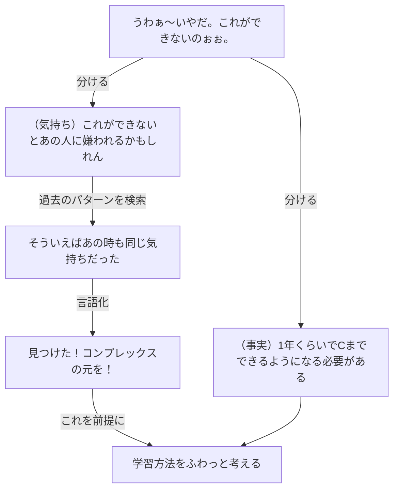

:::message
この記事は株式会社マネーフォワードの福岡開発拠点が主催している [Money Forward Fukuoka Advent Calendar 2024](https://adventar.org/calendars/10009) の記事です。
昨日は @Rikuto Morimoto さんによる TODO 埋める
:::

こんにちは。ダイの大冒険ガチ勢の[bun913](https://x.com/bun7623514)と申します。

皆さんは何かの問題に直面した時の学習法を体系化されていますか？自分なりに抽象化した手順を持っておくと、問題に直面した時にもスムーズに対処できるようになって良いですよね。
特に私はかなりめんどくさい性格をしているので、学習で嫌な気持ちにならないように自分自身に気を遣っています。

今回は私が直面している英語学習の問題に対するアプローチを通しながら、問題に対処する学習法をご紹介します。

## 3行まとめ

- 学習を要する問題に直面した時に、自分の気持ち と 事実を 区別する
- 最も効率の良い方法よりも、その気持ちを大事にした学習方法を考えてあげる
- それにより、無理なく継続できる学習を実現する

## 1. 気持ちは分けるだけじゃない。できるだけ寄り添ってあげる。

さて、特に技術畑の方は問題に直面した時に事実と気持ちを分けた上で、大きな問題を小さな問題に分解して解決することが得意な方が多い印象を受けます。

私は問題が外の環境起因により解決に自分の学習を伴う問題である場合は**事実と気持ちを分けて事実に対処する**というよりも、あえて**分けた気持ちを言語化して、学習方法を考える**というアプローチを採用しています。

というのも、たいていの問題は学習に数ヶ月以上の期間を要するものであるため、その問題に対しての気持ちを分けて傍に置いてきながら学習方法を考えると、途中で挫折してしまうことが多いからです。ただ私は **心から納得して学習を無理なく続けたい** だけなのです。誰かの意見やメソッドにやらされている感では長時間は無理なのです。

私が今直面している課題といえば、英語学習です。マネーフォワードでは英語によるコミュニケーションを推進していて、私のそれを承知の上で入社しました。（2024年7月入社）

https://note.com/tabuchi_shizuka/n/nd9e538d8f222

ただ、実際に入社してみると周りのチームメンバーと私の英語力の差は歴然であり、**英語が全然できないから学習をしないと**という強めの問題に直面しました。

### 1.1. 問題の背景にある「〜なのに」を見つける

さて、私の気持ちの部分と事実を分けて考える時に、大抵の場合は「〜なのに」「〜だというのに」という感情が隠れていることが多いです。

今回の英語学習の場合、以下のようなコンプレックスがすぐに見つかりました。

- （周りのチームメンバーは英語ペラペラなのに）私は英語が全然できない

私は元々の性格に加えて、5年前までIT技術とは全く関係のない公務員時代を過ごしているため、若さや時間に対する焦りのようなものが人よりあると感じています。（それでも前に比べればだいぶマシになりましたが）

### 1.2. 過去に同じ気持ちに直面した時のことを思い出す

私を嫌な気持ちにさせている **〜なのに** が見つかったので、過去にも同じような気持ちに直面した時のことを思い出してみます。

過去に同じ気持ちになったけど、今は平気（忘れてた）であれば同じアプローチが使えるかもしれません。

今回の例で言えば、以前も同じような **~なのに** に直面して、気持ちを言語化して対応した経験を思い出しながら整理していきます。

- （周りのチームメンバーは技術がすごいのに）私は技術が全然できない
  - 周りと比べて嫌な気持ちになって、紙に書いて整理してたなぁ（興味があれば[周りのすごい人と比較してしまう時などに良かった思考の整理法を紹介します | DevelopersIO](https://dev.classmethod.jp/articles/zerosec_thinking_method/)を参照してください）
  - 結局年齢というよりも、俺が周りの人をすごいと思うのは「なにか積み重ねてきたもの」を見て尊敬することが多いんだった
  - 今回でいえば、みんな学生時代に英語を学んだり、受験の時に積み重ねてきた人たちなんだろうなぁ
  - そういえば、俺高校時代にまともに家で勉強したことなかったわ。
  - じゃあ英語できなくて当然だ！頑張ってる人に対して才能とか年齢とか考えるの失礼だぞ！

という感じで整理できたら、「英語ができない」と感じている気持ちをもう少し言語化してみます。

- じゃあ、何が周りと比べて問題と感じてるんだろう？
  - 書く・読むはツールを使えばなんとかなる（こともある）
  - 聞くのも実は「どんなことを話しているか」くらいまでならわかることが結構ある
  - だけど、自分の言葉がでてこない
  - つまり「話せない」が感じている中でいちばんの課題なんだな
- では、少しでも話せるようになるためにはどういう風に学習していけば良いのかな？
  - ある程度話せるようになった後で、ちゃんと体系的な学習をしたいな
  - 本当は体系的な学習の後に、話す練習をした方が良さそうだけど、最初にある程度のラインで話せるようにならないと、みんなにも迷惑がかかってしまうし
  - スピーキングをある程度のレベルまで持って行ってから、体系的に学習するようにしてみたいな
  - その間多分技術の勉強の時間減ると思うけど、その後は英語のコンテンツも読めるようになってブーストするからセーフセーフ。知らんけど。

などというように、自分では（もう）コントロールできない問題に整理をつけながら、比較的未来志向の気持ちを見つけてあげることができました。

## 2. 全体の学習分野を把握して、学習の順序をなんとなく考える

やっと気持ちを言語化できたので、「ある程度話せるようにならないと」という気持ちを大事にしてあげます。

書店に並んでいる参考書や学習法の書籍を確認して、分野別の勉強に分けられそうであることを確認しながら、スピーキングは「相手の言うことを聞けて」「自分の考えを瞬間的に英語で言える」ことなので、とても複合的なスキルなのだろうと感じました。

本来は以下のような順番で分野ごとに学習するのが効率的なのかもしれません。

- 英単語・英熟語
- 英文法
  - 英語の構造を把握するためのルールブック
- 英文解釈
  - 長文を読む前に個別の文章を正しく読めるようにする
- 長文読解
  - これまでの知識を使って長い文章を正確に読む
- 英作文
  - 読むから自発的にアウトプットできるようにする
- スピーキング

しかし、私は「ある程度でいいからまずは話せるようになりたい」という意思が強いので、まずはスピーキングの分野で小さな成功体験を積ませてあげたいです。

そこで、以下のような手順で自習を進めていくことにしました。

- （中学レベルの）英文法を瞬間英作文で馴染ませる
  - 簡単な英語をスパッと言えるようにしながら、英語の語順を覚える
- （大学受験レベルの）英単語を例文で覚える
  - 単語だけある程度覚えておけば、最悪1文ずつ作れるようになるはず
  - 例文を頭に入れておけば、スピーキングの時に使えると思うし
- 毎日のオンライン英会話をスタート
  - 30分で良いのでできるだけ毎日話して、瞬発力をあげよう
- ここから、正しい英語を話すための体系的な学習をしよう
  - 大学受験レベルの英文法
  - 大学受験レベルの英文解釈（今ここ）
  - 大学受験レベルの長文読解
  - さらに単語を増やす
  - 大学受験レベルの英作文

後で具体的な学習方法もご紹介しますが、学習を始めて5ヶ月ですが、挫折なく・意欲を高く学習を続けられています。明らかに大学受験の時よりも英語の学習を楽しんでいると思います。

## 3. これまでの成果と学習方法

### 3.1. これまでの成果(5ヶ月間)

自分の実感だけでは辛いので、勉強をする時には以下の指標を一つの目安として測るようにしています。

- [TOEIC(L&R)](https://www.iibc-global.org/toeic/test/lr.html)のスコア
  - 読む力と聞く力の指標にしています
  - ただし、この試験に特化した学習はしません
  - ちなみに2022年ごろに受験した時のスコアは675点でしたが、これは中学レベルの英文法を覚えて単語を効率的に学習し、小手先の技術でスコアをとったという感じです
- [PROGOS](https://progos.ai/)
  - 英語のスピーキングテストです
  - モバイルアプリで毎日受験できますが、2週間に1回程度のペースで受験しています
  - [評価の指標](https://progos.ai/cefr.html)

| 項目                     | 2024年7月時点 | 2024年11月末時点                    |
| ------------------------ | ------------- | ----------------------------------- |
| TOEIC(L&R)               | 675           | 795                                 |
| PROGOS                   | A2            | B1 High（最頻値）,B2(最高値)                     |
| グローバルメンバーの反応 | 「？？」      | 「Your English is getting better!」 |

その他実感として、自分の英語力の向上を感じています。

- 日常会話がかなり通じるようになってきた
  - 最初は `I can play the piano` しか言えませんでした。ピアノは弾けません
  - 参照: [I can play the piano 以外の言葉がでてくるようになった英語学習。ピアノは弾けない ｜bun913](https://sizu.me/bun913/posts/xbddfdi55vxs)
- ゆっくりEnglishで会議で何を話しているか、大体わかるようになってきた
  - ただし、皆さんが本気の速さで話すとまだまだついていけません
  - まだ、技術的なトピックなどを自分の主体的な意見として話すのは難しいと感じています
- Globalメンバーに褒められるようになった
  - 先日3ヶ月ぶりに直接話した方から `Your English is good` や `Previously, he frequently paused to think about what to say` という嬉しい反応をいただきました

### 3.2. 具体的な学習方法

会社の方でも英語学習を推進するため、かなり良い研修や制度を提供してくれているのですが、それとは分けて私が特に効果があったと感じる学習方法をご紹介します。

:::details 長いので折りたたんでいます。興味があればご覧ください

### 2024.7 ~ 2024.8 中旬

以下の書籍で瞬間英作文を学習しつつ、中学英語を英語の語順で理解しながら話す練習をしました。

https://ibcpub.co.jp/detail/9784794607980/

8月中旬時点で30週くらいしたと思います。この書籍だけで PROGOS は B1を取得できるようになりました。

### 2024.8中旬 ~ 10月

Duo3.0 という例文型の単語帳を30周ほどして、英単語を例文の中で覚えていきました。

https://www.icp-duo.jp/duo30

最初の3週はとにかく丁寧に、1文を10回以上読みながら繰り返しましたが、時間もかかるし覚えられないので苦しかったです。

5週目くらいから音声を聞けば意味がわかるようになっているので、1時間で復習できるCDを聴き、ながら学習で早く回すようにしました。

この時点では PROGOS は B1 ~ B1 High を取得できるようになりB1から下になることはなくなりました。

### 2024.10 ~ 現在

この時期より[NativeCamp](https://nativecamp.net/)というオンライン英会話を始めました。

講座としては「5分間ディスカッション」や「Deaily News」という自分の意見を話すことができる講座を受講しています。

英文法などを学習できるコースもあるのですが、それは自分の時間で学習できるのでスピーキング練習とは分けています。

### 2024.10 ~ 2024.11

毎日のスピーキングの練習と並行して、大学受験レベルの英文法の学習を始めました。

何冊か本を読んでいるうちに、関一生さんの書籍が私にはとてもわかりやすかったので、書籍は関さんのもので統一するようにしています。

https://www.kadokawa.co.jp/product/321611000801/

https://www.kadokawa.co.jp/product/322403000571/

10月の終わりに受験したTOEIC(L&R)のスコアは795点を取得できました。

### 2024年12月以降の学習予定

まず以下の書籍と問題集で英語の読解力を身につけたいと思っています。

https://www.kadokawa.co.jp/product/322403000572/

https://www.kadokawa.co.jp/product/322212000218/

その後に、同様に長文読解の問題集を解きながら、英語を正しく読む力を身につけたいと思っています。

https://www.kadokawa.co.jp/product/321604000262/

英語を正しく読む力がついてくれば、早く読む力も自然と付いてくると思うので、その間に単語力に不安を感じればさらにボキャブラリーを増やすように単語帳を使って学習していきたいと思っています。

英語を読む力がある程度ついてくれば、次は英作文の学習・発音やリスニングの学習と続けていきたいと思います。

:::

## 4. まとめ

- 学習を要する問題に直面した時に、自分の気持ち と 事実を 区別する
- 最も効率の良い方法よりも、その気持ちを大事にした学習方法を考えてあげる
- その結果、英語学習をちゃんとやり直すことになった
  - めっちゃちゃんと勉強している実感があります
  - １日3時間以上は確実に英語の勉強に割いていますが、ある程度のレベルに到達するまでは技術の学習よりも優先してやっています

以上、長文をお読みいただきありがとうございました。めんどくさい性格をしている私の学習法が、少しでも誰かの学習法に役立てば幸いです。
