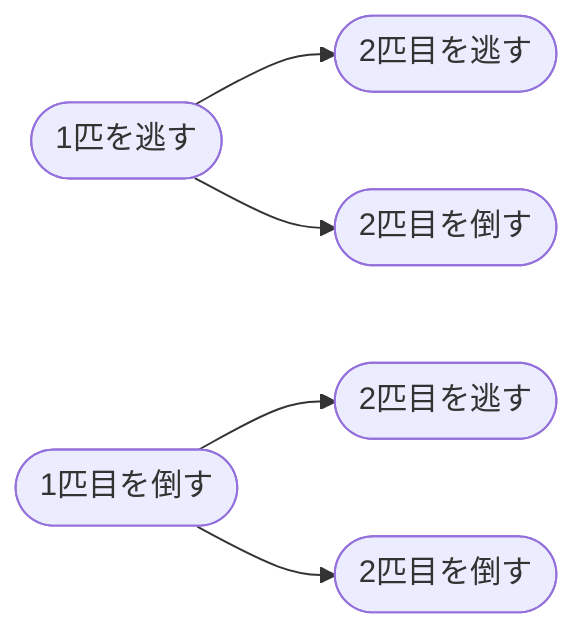

こんにちは。ダイの大冒険ガチ勢の[bun913](https://x.com/bun7623514)と申します。

皆さんはAtCoderという競技プログラミングに気軽に参加できるサービスをご存知でしょうか？

https://atcoder.jp/

競プロと聞くと一見とっつきにくいですが、普段プログラミングができない方でも「**この制約だと絶対に2秒じゃ終わらない。俺じゃなきゃ見逃しちゃうね。**」と浸れるので、とてもおすすめです。

まったく参加したことのない方でも、以下のような記事を見るだけで簡単な問題を解けるようになりますので、興味があればぜひ見てください。

https://qiita.com/drken/items/fd4e5e3630d0f5859067

この記事は以下のような1社会人のエンジニアとして、限られたリソースの中でも復習をしつつも、同じレベル帯の方になんらか参考になることがあるかもしれないというモチベーションで書いています。

- 私の状況・現況
  - 茶色コーダーと呼ばれる下から2番目のランクづけ
    - 参考: [Algorithm部門のレーティングと業務における期待できる活躍 - AtCoderInfo](https://info.atcoder.jp/utilize/jobs/rating-business-impact)
  - 競プロ好きだけどつよくない
  - 正直数学はできない
  - 競プロに全てのリソースを割くことはできない
    - ので、公式の[AtCoderで強くなるには](https://info.atcoder.jp/more/practice/stronger)のとおり復習だけすることにしました

## [A - 369](https://atcoder.jp/contests/abc369/tasks/abc369_a)

### 考えたこと and 正解になった実装

- 等差数列を考えるから、普通にやるならAとBの差をとってそれを使えば良さそう
- でもA問題で変に考えて間違うのは本当に怖いな
- 幸い問題の条件からAもBも1以上100以下とあるから、素直にxを小さい数から全探索して[A,B,x]をソートして、等差数列になるか判定した方が楽だな
- と、考えて以下のように実装しました

```python
from sys import setrecursionlimit

setrecursionlimit(10**8)


def solve():
    act()


def act():
    A, B = map(int, input().split())
    ans = set()
    for c in range(-500, 501):
        L = [A, B, c]
        L.sort()
        if L[1] - L[0] == L[2] - L[1]:
            ans.add(c)
    print(len(ans))


solve()
```

なお、後で解説を見て「確かに」となったのですが、以下のように3つの場合分けでO(1)で解くことができるようです。

https://atcoder.jp/contests/abc369/editorial/10832

「冷静に場合分け」よりも「全探索」を選んでしまうのが、コンテスト中のリアルを感じますね！

## [B - Piano 3](https://atcoder.jp/contests/abc369/tasks/abc369_b)

### 考えたこと and 正解になった実装

- 左手と右手を使ってピアノを弾くと
- それぞれ「どっちの手で」「どの鍵盤を押すか」という情報が与えられる
- その時手を置いている鍵盤から次の鍵盤までの距離だけ疲労がたまる
- 最初に置く位置は自由に選べるので、最初におく鍵盤の位置に両手をおければ最小限の疲労で済むはずだよね
  - あとは順番に鍵盤をたたくので、それ以外で工夫できる場所がないはず
- ということで、以下のように実装して正解になりました

```python
from sys import setrecursionlimit

setrecursionlimit(10**8)


def solve():
    act()


def act():
    N = int(input())
    A, S = [], []
    for _ in range(N):
        a, s = input().split()
        A.append(int(a)-1)
        S.append(s)
    # 左と右がどこかで使われるなら初期位置で固定しておく
    l, r = 0, 0
    if "L" in S:
        l = S.index("L")
        l = A[l]
    if "R" in S:
        r = S.index("R")
        r = A[r]
    ans = 0
    for i in range(N):
        a = A[i]
        hand = S[i]
        if hand == "L":
            ans += abs(a-l)
            l = a
        else:
            ans += abs(a-r)
            r = a
    print(ans)


solve()
```

## [C - Count Arithmetic Subarrays](https://atcoder.jp/contests/abc369/tasks/abc369_c)

### 考えたこと and 正解になった実装

- 長さ1の数列の時は答えが1になるよな
  - 真っ先にNの制約を確認して、エッジケースを考えました
- あとは以下のような表を作りながら整理することで、その時の連続しているストリーク数が分かれば部分列を計算していけば良いことに気づきました

| 何番目     | 1   | 2   | 3   | 4   |
| ---------- | --- | --- | --- | --- |
| 値         | 3   | 6   | 9   | 3   |
| 差         | 3   | 3   | 3   | -6  |
| ストリーク | 1   | 2   | 3   | 1   |

- ただし、配列の最後の要素がstreak2以上で終わっている場合を考慮してあげる必要があるので、以下のように実装しました
  - 何回か「あれ〜なんで数が合わないんだっけ」となりましたが、サンプルのテストケースにこの条件が含まれていたので、なんとか解けました

```python
from sys import setrecursionlimit

setrecursionlimit(10**8)


def solve():
    act()


def act():
    N = int(input())
    A = list(map(int, input().split()))

    # 長さ1は絶対1なので終了
    if N == 1:
        print(1)
        return

    # 要素間の差分を取る
    diffs = [A[i] - A[i-1] for i in range(1, N)]

    ans = N  # 長さ1の部分列
    ans += N - 1  # 長さ2の部分列

    streak = 1
    for i in range(1, N-1):
        if diffs[i] == diffs[i-1]:
            streak += 1
        else:
            if streak >= 2:
                # 長さ3以上の連続した等差数列の部分列を数える
                ans += (streak * (streak - 1)) // 2
            streak = 1

    # 最後の連続した等差数列を処理
    if streak >= 2:
        ans += (streak * (streak - 1)) // 2

    print(ans)


solve()
```

## [D - Bonus EXP](https://atcoder.jp/contests/abc369/tasks/abc369_d)

### 考えたこと（コンテスト中に解けず）

- 単純にモンスターを倒すか逃げるかの選択肢があると
- つまり図で考えるとこんな感じの状態の遷移があるんだな



- なにも考えず全探索すると2**N になっちゃうから絶対に計算が間に合わない
- 要するに「前に倒したか」「何回目だったか」みたいな情報をうまく管理できれば解けそうだけどなぁ
- 多分動的計画法（DP）で解けると思うんだけど、どうやって状態を管理すればいいのかがわからない

と考えていていくつか提出をしてみたのですが、解けずに終わってしまいました。

### 解説を見て出した解法

```python
from sys import setrecursionlimit

setrecursionlimit(10**8)


def solve():
    N = int(input())
    A = list(map(int, input().split()))
    INF = 10**18
    # dp0は奇数回目の攻撃後の最大経験値,dp1は偶数回目
    dp0, dp1 = 0, -INF

    for x in A:
        tmp = dp0
        # 逃がして現在の値をそのまま使うか、前回の偶数攻撃後にモンスターを倒す
        dp0 = max(dp1 + 2 * x, dp0)
        # 前回の偶数攻撃後にモンスターを倒すか、そのまま使うか
        dp1 = max(tmp+x, dp1)
    print(max(dp0, dp1))


solve()
```

解説を見て以下のようなことを考えていました。

- 考えるべき状態としては「奇数回目の攻撃後の最大経験値」「偶数回目の攻撃後の最大経験値」だけでよい
- それが分かればそれぞれの状態を都度「逃したか」「倒したか」で更新していけばよい
- 頭よすぎじゃない？DPやれば慣れてとけるようになるのだろうか

なお、私はほとんどDPに特化した勉強をできていないので、これを機会に色々なパターンの問題を解いていきたいと思いました。

## まとめ

- ABC369に参加して、コンテスト中に3問だけ解くことができました
  - 私はC問題は絶対解きたい、D問題は簡単なら解きたい。というスタンスで参加しているので最低目標は達成できました
  - 一方でC問題までを早く解くことも、正解者が割と多いD問題を解くこともできなかったのが悔しい結果となりました

私のような「リソースを競プロにあまり使えない人」こそ、「解けなかった一問だけ解説を見ながら解く」、「もっといい解法がないか解説を見てみる」ということが重要だと感じています。

今後も「楽しいからやる」というスタンスは保ちつつ、自分のペースで下がったり上がったりを繰り返しながら強くなっていければいいなと思います。

以上、bun913でした。ありがとうございました。
