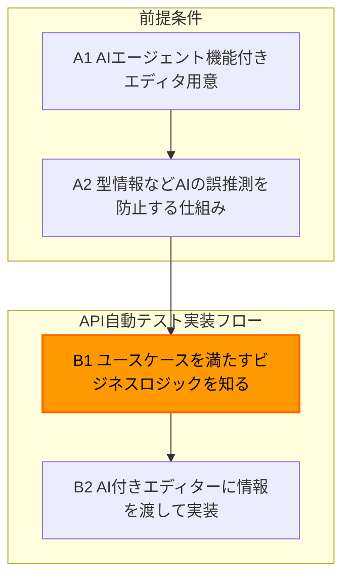

こんにちは。ダイの大冒険エンジョイ勢の[bun913](https://x.com/bun7623514)と申します。

みなさんはAPIテストを書く時に、「もうCursorとかでどんな時にどういう順でAPIが呼ばれるか、仕様の把握からテストコードの作成まで自然言語で指示できないかな」と思ったことはありませんか？私はあります。

今回は以下のB1のように、**特定のユースケースを満たすために、呼ばれている一連のAPIを把握**して、そのままAI搭載エディタにテストを書いてもらうということを[Playwright MCP server](https://github.com/microsoft/playwright-mcp) に搭載された [Network](https://playwright.dev/docs/network)機能を使って、試してみました。

- どんなAPIが呼ばれたか？
- では `API: hoge` と `API: fuga` の結果、ユーザーにはこのような情報がみえるべきなのでそのテストを書きましょう

といったことを自然言語で指示して、開発のバックグラウンドのない方でもAPIテストをPlaywrightで記載できるか試してみました。

:::message
後にも出てきますが、AIや人間がテストを誤推測なしで書けるような環境や基盤作りは最初に開発者やSETが整えると良いと思います。この記事では、その前提のもとで検証を進めています。
:::

## 前提となる知識

みなさんはMCPというプロトコルをご存知ですか？

ご存知ない方は、ぜひ以下の資料をご覧ください。そこまで深く理解する必要はなく、自分なりに「なんかAIエージェントに機能を付与するための共通の仕組みかな」といった程度の理解でも（この記事では）問題ありません。

https://dev.classmethod.jp/articles/shuntaka-mcp-study/

Cursor や VSCode などのAIエージェント機能（AIに自然言語で指示をすれば色々やってくれるもの）を保有しているエディタにおいて、以下のような [Playwright MCP Server](https://github.com/microsoft/playwright-mcp)を使えばブラウザ操作を自動化し、エディタ内のチャットでそのまま「じゃあそのボタンを押したら、エラーがトップに表示されることを確認するテストを書いて」といった指示が可能です。

https://qiita.com/ore88ore/items/106c851e56631045fe25

## APIテストの立ち位置と日々の実装フロー

### この記事でのAPIテストの意味

さて、APIテストと一言で表現しても人によって想像することが違いそうですよね。

- Ruby on Rails でいうところのRSpecのように個々のAPIが意図する挙動になっているか確認する
- Postman などのツールで、ユースケースを満たすために必要なAPIを順次呼び、レスポンスが意図する形になっているか確かめる

今回で私が表現しているAPIテストとは、「ユーザーの操作により、裏で呼ばれている一連のAPIの処理で達成される特定のユースケース」を検証するというような使い方を想定しています。

例えば架空の本人確認を行うためのアプリケーションを想像した時に、以下のような一連の機能を呼び出すことで、「日本国籍の人は、運転免許証やマイナンバーカードでしか本人確認ができない」というシナリオを確かめることができます。

- 本人確認を行う人の情報を入力
    - この時日本国籍を選択
- 本人確認書類を選択
    - この時種別として在留カードを選択
- 意図する挙動になっているかを確認
    - エラーメッセージが意図する形式で返却されている
    - 本人確認状況が「未提出」のままである

実際は、フロントエンドアプリケーションに入力した情報を元にバックエンドAPIを呼んでいます。これらAPIを実際に呼んでみて、最終的な目的を果たせているか確かめるイメージであり、ビジネスユースケースのリグレッションテストに近いと思います。

UIテストの自動化に比べて、ブラウザやUIなどを介さないため比較的壊れにくく、重要なビジネスロジックやデータを管理するバックエンドの挙動を比較的短い実行時間で確かめることができます。

### 日々のフロー

この記事の最初にお見せしましたが、簡単にいうと以下のようなフローで実装をします。

もちろん本当は事前に「何をテストするか」ということを決めてからテストケースを整理するのですが、今回は「どうやってAPIテストを日々実装しているのか」という部分にフォーカスして簡略化しています。

#### A1: AIエージェント機能付きエディタの用意

ここは特に書くことがないのですが、以下のようなAIエージェント機能を搭載したエディタを準備します。（おそらくルールやプロンプトのカスタマイズで生産性が異なると思うのですが、私はそこまで試せていません）

- [Cursor](https://www.cursor.com/ja)
- [Use agent mode in VS Code](https://code.visualstudio.com/docs/copilot/chat/chat-agent-mode)

#### A2: 型情報などAIの誤推測を防止する仕組みを構築

例えばRESTの形式を利用しているAPIでも[Swagger](https://swagger.io/)などのドキュメントをプログラム上の型から自動生成して、ドキュメントと実際の型情報の一致を目指すことがありますよね。

[GraphQL](https://graphql.org/)などを採用している場合でも、プログラム上の型からGraphQLで表現できる型への変換などを行うケースが多いと思います。

その場合型が決まっているため、APIを呼び出す側のクライアントは型情報の恩恵を預かることができます。

さらに実際のプロダクトでは、[@graphql-codegen/cli](https://the-guild.dev/graphql/codegen)などを活用して、 `.graphql` ファイルからプログラム言語で呼び出せる `*.ts` や `*.go` と言った形式を自動生成して、プログラム上でエディタの型補完の恩恵を受けることができます。

以下の記事ではGraphQLのスキーマからプログラム言語で利用できる型情報の生成などのイメージをつかめると思います。

https://zenn.dev/osawa_koki/books/f3a06800725213/viewer/04_use-graphql-codegen

今ほどAIによる開発の生産性向上がトレンドになっていない時でも、これらを使うことにより「人間が実際のリクエストやレスポンスの型の情報とエディターの恩恵を得られ、テストが書きやすくなった」という素晴らしい利点がありました。

AIと共存するコーディングスタイルの場合でも、 **型があることでAIが勝手に推測して派手にテストを間違えることを防いだり、提案の質があがる** といった恩恵を感じています。

このようにAIをうまく使うという意味を含めても、型の自動生成などすべてをAIに任せきる前に環境を整えてあげます。これには、ディレクトリやファイル構造、ドキュメント、そして自分が書いた理想的なテストコードのサンプルなどの準備も含まれています。

#### B1: ユースケースを満たすためのビジネスロジックを知る

いよいよ「ではどのようにAPIを順番に呼び出せば良いのか」ということを整理する段階となります。

ここでは理想として、よくまとまった仕様書などのドキュメントがあれば問題ないのですが、実際はすべての現場でドキュメントが整備されているわけではありませんよね。

実際はWebフロントエンドが呼んでいるAPIリクエストをモニタリングして、リバースエンジニアリング的に機能を把握しているという人も少なくないのではないでしょうか。そのような時には Google Chrome のデベロッパーツールなどには習熟しておきたいですよね。

https://developer.chrome.com/docs/devtools/network/reference?hl=ja

私もドキュメントがないが「ソースコードのロジックを追うのはちょっと面倒」と感じる時は素直に、すでに出来上がっているフロントエンドアプリケーションのAPIの使い方を観察して、APIテストを組むことも多いです。

#### B2: AIツールを使ってテストコードを書く

これもすでにCursorの使い方などの記事はたくさんあるので割愛いたします。

ただし、最近では冒頭に説明したMCPというプロトコルを使うことで、AIエージェントにさまざまな機能やツールを提供できます。中でも、テスト界隈がざわついたのは[Playwright MCP server](https://github.com/microsoft/playwright-mcp)ではないでしょうか。

以下の記事のように、Cursorなどのエディタのチャットから自然言語で指示することでブラウザを操作してもらい、そのままテストコードを書く指示を出すことなどが想定されますよね。

https://qiita.com/ore88ore/items/106c851e56631045fe25

しかもこの場合、実際のブラウザの状態などのコンテキストを持っているため、人が常に「この要素をクリックして」などと言わずに、「青いボタンをクリックして」などの指示ができ、そのまま普通よりも手がかからずにテストコードを書いてくれそうですよね。

## 試してみたこと

### Playwright MCP への機能追加

上記の `B1: ユースケースを満たすためのビジネスロジックを知る` について、B2のようにCursorなどのエディタからMCPを使うことで、自然言語でブラウザを操作できるなら、 **ユーザーの操作により裏で呼ばれているAPIコールを監視してもらって、どんなAPIをどの順でどのように呼んでいるのかということも自然言語の指示だけで把握してもらい、APIテストを楽に実装できるのでは？** と考えました。

実際、Playwrightには[Network | Playwright](https://playwright.dev/docs/network)という機能があり、そのブラウザで発行されているAPIリクエストなども監視ができそうでした。

しかし私が確認した [v0.0.14](https://github.com/microsoft/playwright-mcp/releases/tag/v0.0.14) には、このネットワークの機能を監視する機能がなく、「今どんなAPIが呼ばれた？」などと聞いても答えられませんでした。

そこで以下のように「Network監視機能が欲しい」という Issue を立ててみたところ、驚くべきことに数日以内に機能が追加され新しいバージョンがリリースされました。（オープンソースコミュニティの対応速度に感謝です）

https://github.com/microsoft/playwright-mcp/issues/242

ただし、この時点では実はリクエストの内容を監視するといっても、実際は`[GET] http://localhost:8907/query?param1=value1&param2=value2` というように、どのHTTPメソッドでどのURLにリクエストをしたか、 という情報しか取れませんでした。

直接開発者に聞いたわけではありませんが、実際多くのAIモデルでは「コンテキストウインドウ」と呼ばれる保持できるコンテキストの量はかなりシビアなので、それを節約するためだと思われます。実際、私がMCPサーバーを実装する中でも、JSONにすると1MB～2MB程度の情報を返す機能をMCPサーバーに用意していたところ、すぐにコンテキストウインドウがいっぱいになってしまいました。

https://zenn.dev/moneyforward/articles/6deaa22428a109

とはいえこの機能でリクエストの内容やレスポンスの内容が無いのはかなり厳しいため、リポジトリをフォークして、リクエストBodyやレスポンスBodyなどの情報も付与できるように改修してみました。（以下はその時のPull Requestです）

https://github.com/microsoft/playwright-mcp/pull/251

### やっぱりコンテキストウインドウがいっぱいになってしまうため改良

実際に動作している業務サービスや人気のWebアプリケーションなどでは、多くのNetwork上でのリクエストが観測できますよね。

以下は私の単なるブログサイトを開いた時の Chrome の 開発者ツールの表示画面です。特に動きがないようなサイトでさえ、なかなかの量ですよね。

それを考えずに、リクエストやレスポンスを記憶させようとすると一回のボタンクリックからの画面遷移で、すぐにコンテキストウインドウの容量に達してしまいました。

### XHRリクエストのみフィルターするように改良してみた

とはいえ、さすがに少しのリクエストの監視だけでコンテキストがいっぱいになるのは不自然です。

よく考えると、 **CSSやJSなどの読み込みも監視対象に含まれているから、それらの容量が原因では？** と考えて、`Network` タブ上でいうところの `XMLHttpRequest (XHR)` リクエストのみをフィルターするように試してみました。

https://github.com/microsoft/playwright-mcp/pull/251/commits/1f915748f57f0843e42ef14f1005c6bebc06369c

すると、以下のようにちゃんとどのようなAPIをどのような形式で呼んでいるか、という情報を取得してくれるようになりました。

あとはこれと同様に操作を繰り返すことで、以下のような効率的な指示中心のループに入ることに成功しました。

- 私「今手動でまた画面を移動しました。どのような画面かわかりますか？」
- Cursor「（ブラウザのスクリーンショットを取得して状況を把握）はい。このような情報が表示されています。」
- 私「その画面上のアイテムの一覧を取得したAPI呼び出しはどんなものか教えて」
- Cursor「はい。では〜（どのようなパラメーターでどのようなAPIを実行したか教えてくれる）」
- 私「じゃあそのAPI呼び出しを定義ファイルとして作成して、TypeScriptの型を作成するコマンドを実行して」
- Cursor「はい。（実行）」
- 私「OK,では先ほど作った A のクエリを実行したあとは、実はBのクエリに hoge というアイテムが含まれなくなるんですよ。それを検証するテストを `hoge.spec.ts` というファイルを参考に作ってみて」
- Cursor「はい。（実行）」

少なくとも私が試した限り4～7ページの遷移を含む一つのコンテキストウインドウの中で、容量がいっぱいになることなくAPIテストに必要な情報を取得し、さらにそれをテストコードとして書き出してくれました。

## まとめ

- Playwright MCP を改良してどのようなネットワークリクエストをブラウザ上で呼んでいるか見えるようにしてみました。
  - https://github.com/microsoft/playwright-mcp/pull/251
  - 記事公開時点でマージされていない場合は、代替手段として独自のフォークを使用するか、機能が取り込まれた新バージョンの情報を追記予定です。
- 当初失敗していた「ブラウザ上の操作の意味と実際に呼ばれているAPIの把握」という課題を解決し、AIエージェントにビジネスシナリオに沿ったAPIテストを実装してもらうことができました。
- これにより開発者やSETが基盤を整備すれば、開発経験のないQAエンジニアのようなかたでもAPIテストをかなり書きやすくなる可能性を感じています。
- とはいえ、まだ非常に長いシナリオを試したわけではありませんし、生成されるコードの品質保証のためにコードレビューや人間の介入は引き続き必要だと考えています。

以上、長い文章を読んでいただきありがとうございました。bun913でした。
