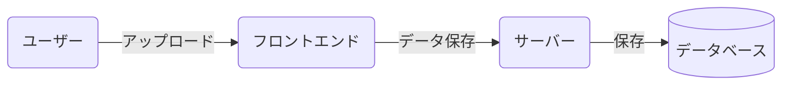
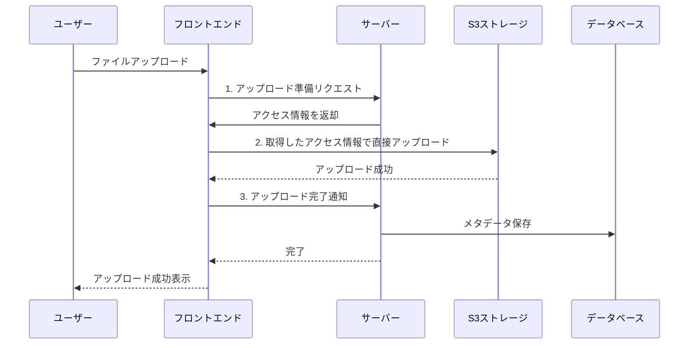

こんにちは。ダイの大冒険エンジョイ勢の[bun913](https://x.com/bun7623514)と申します。

私はSDET(Software Development Engineer in Test)という職種で働いています。日本ではあまり馴染みのない職種ですが、とても簡単に説明すると、開発者の知見を活かしてテストやQAの領域に貢献するエンジニアです。

:::details もしSDETという職種について詳しく知りたい方は、以下のURLを参照ください。求人ページに繋がるので、不快な方はスキップしてください。
https://hrmos.co/pages/moneyforward/jobs/2121455132004343828
:::

自分やみんなの安心感を高めるために自動テストを書いたり、CI/CDの改善をするのも大事ですが、ドメインとテスト技術を理解している方の手動テストはとても価値があると感じています。

そんな中、手動でテストをしようと思うと面倒なことがたくさんありますよね。データ作成、テスト実行、「あぁぁ・・・ここのテストをしたいだけなのに、毎回テスト用のデータを作らないといけないのか・・・」と思うことも。

そんな中、一応開発やAWSエンジニアとしての知見を持つ身として、日々心がけている習慣やテストデータ作成の工夫について紹介します。

記事の対象としては、開発の知見がある方を意識していますが、行うと良い習慣化やAIエージェントを活用する工夫の仕方はQAエンジニアの方にも役立つと思います。

## 効率化の元になる日々の習慣

### 「やってられないぜ」と「あったら楽そう」を消失させない

昨今はObsidianやCursorなどを組み合わせたノート術が流行っていますよね。 
ただ、私の場合はvimなどでメモを取る方法を以前紹介していました。 
https://zenn.dev/moneyforward/articles/e12037a09f436c

最近はひまじんプログラマーでもツェッテルカステンというメモ術をわかりやすく紹介していました。 
https://open.spotify.com/episode/4tFtKNw5hkXgSj9kxUDwcR

このようなメモ術を使うのも良いと思うのですが、私の場合はシンプルに以下のような情報を管理しています。

- やるべきタスク（普通に仕事）
- 改善系のタネ
  - 「やってられないぜ」と思ったこと
  - 「これあったら楽になるんじゃない？」と思ったこと

このデモは以前書いた記事と同じものになりますが、一つのマークダウンファイルに色々情報を書いてゴチャゴチャにせず、タスクごとにマークダウンファイルを分けて管理します。


分けられたファイルでは以下のようなテンプレートが使われています。

```markdown
# OKなどの特定の文言が入っているチェックボックスを全て一括でクリックしてくれるブックマークレットが欲しい

<!-- Obsidianのタグの形式でタグを作成しておくことで、後から移行しやすくしておきます。このタスクファイルを作成した時点ですぐに書きます。 -->
#DevOps #TestData #JavaScript #Bookmarklet

## Reference

<!-- ここになんでそう思ったのか？や参考になる記事やIssueなどがあれば貼ります。このタスクファイルを作成した時点ですぐに書きます。 -->

## Artifact

<!-- 最終的に何かの形でアウトプットを出すため、そのURLを貼ります。タスクがおわったあとに記載します -->

TODO: zennで書いたら記事貼る
TODO: GitHubのPRはる

```

これにより私は改善のタネを極力、忘れないようにしています。これが後の1人DevOpsタイムの改善に繋がっていきます。

### APIのコールを見る習慣

「この処理はどうなってるんだろう？」と思ったときにはChrome の DevToolsで Network タブを開いてAPIのコールを確認するようにしています。1つの機能を実現するための複数のAPIコールを確認することで、自分の認識が広がります。

DevToolsの使い方については、以下の記事がわかりやすかったです。

https://knowledge.sakura.ad.jp/27872/

例えばファイルアップロードの機能について考えてみましょう。

- ユーザーがファイルを選択して、アップロードができること
- アップロードしたファイルはオペレーターによる審査画面で確認できること

といった要求に対して、これまで見えていた世界はこうでした。



そこでAPIコールをみていると以下のように3つのAPIコールがあることに気づきます。

1. フロントエンドアプリがサーバーにAPIコールを行い、何かへのアクセス情報っぽいものを取得しています。
2. 先ほどのアクセス情報っぽいものを使ってアップロードを行っています。URLを渡してAIに聞いてみると、S3というAWSのストレージサービスにアップロードしていることがわかります
   1. また、アクセス情報っぽいものは一時的にしか使えないセキュアなアクセスに必要な情報だということがわかります
3. 最後にアップロードが完了したことをサーバーに通知しています。


これらの仕組みがわかると、先ほどまで見えていた世界がこうなります。



理想的に言えば処理を行なっているサーバーのコードを読むのが一番ですが、内部的な実装を知らなくてもAPIのコールをみて、パラメーターや認証の方法を推測するだけでも、**フロントエンドアプリがラップしてくれているAPIというインターフェースの外側の振る舞いを知る**ことができます。

今後のAPIテストの実装に繋がることはもちろん、個人的には今度は「このS3っていうのはなんだろう」「これが単一障害になることあるのかな？」といった疑問が湧いてきて、さらに学びを深めることにも繋がります。

### 1人DevOpsタイムを作る

さて、ここまでの習慣を続けると、自然と改善のタネが溜まっていきます。そこで、毎週1時間程度だけでも時間を確保して、以下のようなことを行う時間を作っています。

「1人DevOpsタイム」では、タスク化してある改善のタネに着手します。必ずしも実装系のタスクである必要はなく、シンプルに「この技術に関する入門記事を読む」というものでも問題ありません。どう考えても自分一人ではできないことは、仕事化を検討します。

私の1人DevOpsタイムの目的は以下のものと割り切っています。

- 最低目標: 昨日の自分と比べて少しでも知識やスキルが増えていること
- 本当はここまでやりたい: 自分にとって本質的ではない時間を10秒減らすこと
- 理想: 他の人の時間を10秒減らすこと。10秒を10人分、100回繰り返すなら160分以上の時間を削減できます。人数が多ければ1000時間削減もあるかも。

私が開発者としてのキャリアを決めるきっかけは「自分一人が楽になるツールを作ったら、他の人の時間も削減できた」という原体験があったからです。これらの目標の決め方も自分のモチベーションが極力上がりやすいように、ゆるく設定しています。

## 具体的な例1: テストデータを作るのが非常に面倒(Postmanによる改善)

例えば、以下のステップをご覧ください。

1. エンドユーザーによる申請
2. 運用側オペレーターによる審査・承認
3. エンドユーザーによる最後の操作

さて、この3の操作を行うためには当然1と2の操作を行う必要がありますが、この3の操作がユーザーごとに1度しか実行できない操作である場合どうでしょう？

当然毎回テストデータを作成する必要があり手間ですよね。多くの状態を確かめる場合、ユニットテストやUIを解さない形のテストでも実装すると思いますが、実際の画面やユーザーセッションを介して挙動を確かめたい場面は必ずあると思います。

そこで、ChromeのDev Toolsを使ってリクエストの内容を見ながら、それを[Postman](https://www.postman.com/)を使って再現性のあるコレクションとして作成しておけば、毎回手動でUIを介したデータ作成を行う必要がなくなります。

Postmanの使い方については、以下の記事をご参照ください。（今回の記事ではPostmanの使い方を詳しく説明しません）

https://sqripts.com/2022/11/30/22135/

当然Postman上では送信するパラメーターやヘッダーを変更することができるので、リクエストごとに異なるデータを作成できます。シンプルにテストデータを作るだけでなく、ここでPostmanのコレクションを作成しておくことで、実際のAPIテストなどの実装にも役立ち一石二鳥です。また、UIテストの自動化を実装する際にも、必要データの事前作成などは必ずしもUIを介して行う必要はないので、テストデータ作成用のAPIコレクションが役に立つことでしょう。

## 具体的な例2: さくっとUIを操作したい（ブックマークレットの作成）

先ほどはPostmanを使ったAPIコレクションの作成について紹介しましたが、そこまでしたくないけど・・・という場合もあると思います。

例えば、先ほどの例をもう一度見てみましょう。

1. エンドユーザーによる申請
2. 運用側オペレーターによる審査・承認
3. エンドユーザーによる最後の操作

さて、非常に極端な例ですが、2の審査画面に非常に多くのチェック項目があるとどうでしょう？以下のようなチェックボックスを人間（将来的にはAIかもしれませんが）にすべてチェックしてもらう必要があるとします。


10秒〜20秒程度の時間で終わると思います。しかし、これを毎回手動で行うのは面倒です。UIには「1つ1つの確認を確実に行ってもらうために、チェックボックス一括チェック機能がない」という明確な思想があるかもしれませんが、テストデータを作るために毎回手動でチェックするのは面倒です。

そこで、ブックマークレットを作成しておくことで、毎回手動でチェックする必要がなくなります。ブックマークレットでは、ブラウザ上の操作をJavaScriptで記述することで、特定の操作を自動化できます。

例えば、以下の例ではZennの記事を検索できるブックマークレットを作成しています。

https://zenn.dev/ymmt1089/articles/20220415_bookmarklet

例えば以下のようなコードを書いて、ブックマークレットとして利用できる形式に変換することで、JavaScriptについて詳しくない人でも簡単に操作の自動化を行えますし、配布も簡単です。（単にブックマークをエクスポートすればよいだけですから）

```javascript
// シンプルにAIに書いてもらった全ての「OK」チェックボックス（実際はspan要素）をクリックするコード
// Function to find and click all OK buttons
function selectAllOK() {
  // Method 1: Find span elements
  const spans = document.querySelectorAll("span");
  let clicked = 0;

  for (let i = 0; i < spans.length; i++) {
    if (spans[i].textContent.trim() === "OK") {
      spans[i].click();
      clicked++;
    }
  }
  
  // Display results
  console.log(`Clicked ${clicked} OK buttons`);
  return clicked;
}
```

さらにAIエージェントに「ブックマークレットとして使えるように変換して」と指示を出すだけで、ブックマークレット用のコードに変換してくれます。

```javascript
// Bookmarklet version (copy this to your browser's bookmark URL)
// javascript:(function(){const spans=document.querySelectorAll('span');let clicked=0;for(let i=0;i<spans.length;i++){if(spans[i].textContent.trim()==='OK'){spans[i].click();clicked++}}console.log('Clicked '+clicked+' OK buttons');return false;})();
```

### 補足:VSCodeやCursorにコードを書いてもらうための工夫

[playwright-mcp](https://github.com/microsoft/playwright-mcp) と呼ばれるツールを使うことでVSCodeやCursorにチャットで指示を出して、ブラウザを実際に開いて操作してもらうことができます。

https://zenn.dev/aldagram_tech/articles/3614dbabbf2f5d

ただし、そのようなことすら面倒な場合HTMLの要素をChromeのDevToolsで調べて、以下のような情報をAIエージェントに渡すことで、スクリプトを書いてくれます。


それをAIエージェントに渡して以下のような指示を出します。

```
以下はあるWebページのHTMLの一部です。この中に「OK」と書いてあるチェックボックスがあるので、すべてクリックするスクリプトを書いてください。

<div class="styles_inputContainer__tALkw checked" onclick="selectOption(this, 'ok')">
    <span class="styles_radioButton"><span></span></span>
    <span>OK</span>
</div>
```


そうするとAIエージェントが先ほどのようなコードを書いてくれると思います。

書いてくれたコードをそのまま ChromeのDevToolsのConsoleタブに貼り付けて実行することで、コードの挙動を確認できます。


いい感じに動いたらさらに以下のような指示を出しましょう。

```
いいね。いい感じに動きました。では、このコードをブックマークレットとして使えるように変換してください。ブックマークレット用のコードはこのjsファイルのコメントとして出力してください。
```

以下のようにブックマークレット用のコードを文字列を出力してくれます。

```javascript
// Bookmarklet version (copy this to your browser's bookmark URL)
// javascript:(function(){const spans=document.querySelectorAll('span');let clicked=0;for(let i=0;i<spans.length;i++){if(spans[i].textContent.trim()==='OK'){spans[i].click();clicked++}}console.log('Clicked '+clicked+' OK buttons');return false;})();
```

後はこのコードをコピーしてブックマークとして保存します。

保存の仕方については先ほどの記事の[ブックマークへ追加](https://zenn.dev/ymmt1089/articles/20220415_bookmarklet#%E3%83%96%E3%83%83%E3%82%AF%E3%83%9E%E3%83%BC%E3%82%AF%E3%81%B8%E8%BF%BD%E5%8A%A0)のセクションを参照ください。

後はこのページを開いているときに、ブックマークをクリックするだけで、すべての「OK」チェックボックスにチェックが入ります。

## さいごに

今回は私が日々時間を削減するために行なっている習慣や工夫について紹介しました。実際はこのような小技から、「人がオペレーションしている部分をGitHub Actions で自動化する」といった王道の改善まで、様々なことを行なっています。

正直なところ「そんなことをやっている暇がない」「そんな小さなことをしても仕方ない」と思う方も多いと思います。そんな時でも、私は小さな改善のタネを忘れたり、諦めてしまわないことが大事だと思っています。
今回は非常に小さな改善でしたが、「テスト環境でも本番に近いテストをするために日々どんなデータを作っておかないといけないか」「今の環境でもできることはなにか」といったことを考えるきっかけになるはずです。

また、ただ改善を忘れないようにして誰かにメモを共有するだけで誰か別の人がサクッと実装してくれるかもしれません。ただメモを書いておくだけで、誰かの時間を削減できる可能性があるのです。

私個人としては、今後もエンジニアになった原体験を忘れずに、日々の改善を積み重ねてより大きな改善をできる糧にしたいと思っています。

以上、最後まで読んでいただきありがとうございました。
