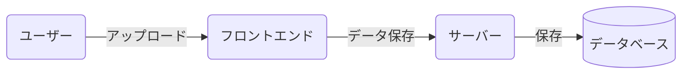
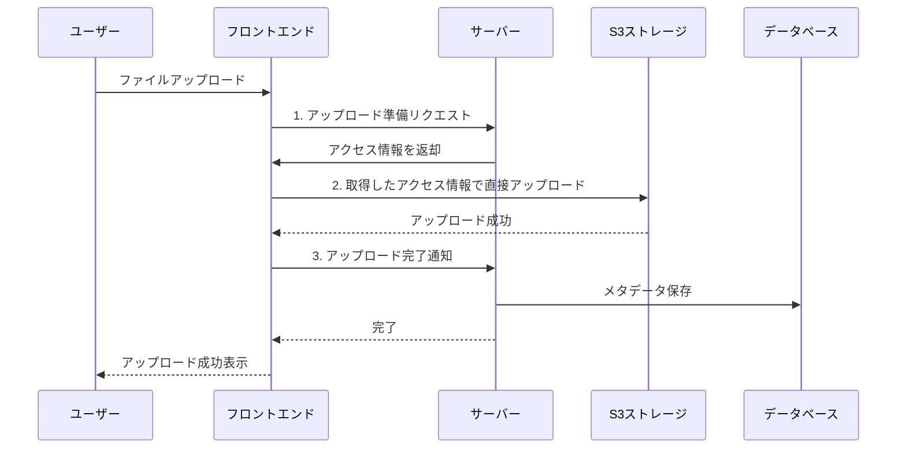
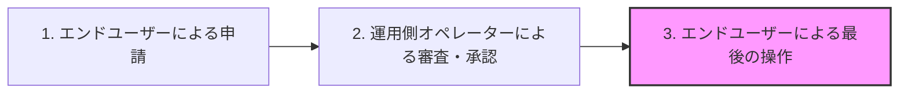
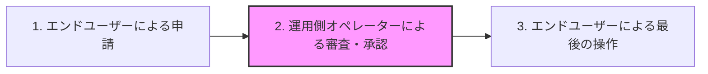

# ゆるい習慣と工夫で1000時間を削減せよ!SDET（SET）の1人DevOpsタイム取り組み！

こんにちは。ダイの大冒険エンジョイ勢の[bun913](https://x.com/bun7623514)と申します。

私はSDET(Software Development Engineer in Test)という職種で働いています。日本ではあまり馴染みのない職種ですが、とても簡単に説明すると、開発者の知見を活かしてテストやQAの領域に貢献するエンジニアです。

:::details もしSDETという職種について詳しく知りたい方は、以下のURLを参照ください。求人ページに繋がるので、不快な方はスキップしてください。
https://hrmos.co/pages/moneyforward/jobs/2121455132004343828
:::

自分やみんなの安心感を高めるために自動テストを書いたり、CI/CDの改善をするのも大事ですが、ドメインとテスト技術を理解している方の手動テストはとても価値があると感じています。

そんな中、手動でテストをしようと思うと面倒なことがたくさんありますよね。データ作成、テスト実行、「あぁぁ・・・ここのテストをしたいだけなのに、毎回テスト用のデータを作らないといけないのか・・・」と思うことも。

そんな中、一応開発やAWSエンジニアとしての知見を持つ身として、日々心がけている習慣やテストデータ作成の工夫について紹介します。

記事の対象としては、開発の知見がある方を意識していますが、行うと良い習慣化やAIエージェントを活用する工夫の仕方はQAエンジニアの方にも役立つと思います。

## 効率化の元になる日々の習慣

### 「やってられないぜ」と「あったら楽そう」を消失させない

昨今はObsidianやCursorなどを組み合わせたノート術が流行っていますよね。 
ただ、私の場合はvimなどでメモを取る方法を以前紹介していました。 
https://zenn.dev/moneyforward/articles/e12037a09f436c

最近はひまじんプログラマーでもツェッテルカステンというメモ術をわかりやすく紹介していました。 
https://open.spotify.com/episode/4tFtKNw5hkXgSj9kxUDwcR

このようなメモ術を使うのも良いと思うのですが、私の場合はシンプルに以下のような情報を管理しています。

- やるべきタスク（普通に仕事）
- 改善系のタネ
  - 「やってられないぜ」と思ったこと
  - 「これあったら楽になるんじゃない？」と思ったこと

このデモは以前書いた記事と同じものになりますが、一つのマークダウンファイルに色々情報を書いてゴチャゴチャにせず、タスクごとにマークダウンファイルを分けて管理します。


分けられたファイルでは以下のようなテンプレートが使われています。

```markdown
# OKとかいう特定の文言が入っていたら全部のチェックボックスにチェックを入れてくれるJSが欲しい

<!-- Obsidianのタグの形式でタグを作成しておくことで、後から移行しやすくしておきます。このタスクファイルを作成した時点ですぐに書きます。 -->
#DevOps #TestData #JavaScript #Bookmarklet

## Reference

<!-- ここになんでそう思ったのか？や参考になる記事やIssueなどがあれば貼ります。このタスクファイルを作成した時点ですぐに書きます。 -->

## Artifact

<!-- 最終的に何かの形でアウトプットを出すため、そのURLを貼ります。タスクがおわったあとに記載します -->

TODO: zennで書いたら記事貼る
TODO: GitHubのPRはる

```

これにより私は改善の種を極力、忘れないようにしています。これが後の1人DevOpsタイムの改善に繋がっていきます。

### APIのコールを見る習慣

この処理はどうなってるんだろ？と思った時だけ良いので、Chrome の DevToolsで Network タブを開いてAPIのコールを確認する習慣をつけています。1つの機能を実現するための複数のAPIコールを確認することで、自分の認識が広がります。

DevToolsの使い方については、以下の記事がわかりやすかったです。

https://knowledge.sakura.ad.jp/27872/

例えばファイルアップロードの機能について考えてみましょう。

- ユーザーがファイルを選択して、アップロードができること
- アップロードしたファイルはオペレーターによる審査画面で確認できること

といった要求に対して、これまで見えていた世界はこうでした。



そこでAPIコールをみていると以下のように3つのAPIコールがあることに気づきます。

1. フロントエンドアプリがサーバーにAPIコールを行い、何かへのアクセス情報っぽいものを取得しています。
2. 先ほどのアクセス情報っぽいものを使ってアップロードを行っています。URLを渡してAIに聞いてみると、S3というAWSのストレージサービスにアップロードしていることがわかります
   1. また、アクセス情報っぽいものは一時的にしか使えないセキュアなアクセスに必要な情報だということがわかります
3. 最後にアップロードが完了したことをサーバーに通知しています。


これらの仕組みがわかると、先ほどまで見えていた世界がこうなります。



理想的に言えば処理を行なっているサーバーのコードを読むのが一番ですが、内部的な実装を知らなくてもAPIのコールをみて、パラメーターや認証の方法を推測するだけでも、**フロントエンドアプリがラップしてくれているAPIというインターフェースの外側の振る舞いを知る**ことができます。

今後のAPIテストの実装に繋がることはもちろん、個人的には今度は「このS3っていうのはなんだろう」「これが単一障害になることあるのかな？」といった疑問が湧いてきて、さらに学びを深めることにも繋がります。

### 1人DevOpsタイムを作る

さて、ここまでの習慣を続けると、自然と改善の種が溜まっていきます。そこで、毎週1時間程度だけでも時間を確保して、以下のようなことを行う時間を作っています。

「1人DevOpsタイム」では、タスク化してある改善の種に着手します。必ずしも実装系のタスクである必要はなく、市のウルに「この技術に関する入門記事を読む」というものでも問題ありません。どう考えても自分一人ではできないことは、仕事化を検討します。

私の1人DevOpsタイムの目的は以下のものと割り切っています。

- 最低目標: 昨日の自分と比べて少し知っている人、できる人が増えた人になっていること。
- 本当はここまでやりたい: 自分にとって本質的ではない時間を10秒減らすこと。
- 理想: 他の人の時間を10秒減らす。10秒を10人分、100回繰り返すなら160分以上の時間を削減できます。人数が多ければ1000時間削減も。

私が開発者としてのキャリアを決めるきっかけは「自分一人が楽になるツールを作ったら、他の人の時間も削減できた」という原体験があったからです。これらの目標の決め方も自分のモチベーションが極力上がりやすいように、ゆるく設定しています。

## 具体的な例1: テストデータを作るのが非常に面倒(Postmanによる改善)

例えば、以下のステップをご覧ください。



さて、この3の操作を行うためには当然1と2の操作を行う必要がありますが、この3の操作がユーザーごとに1度しか実行できない操作である場合どうでしょう？

当然毎回テストデータを作成する必要があり手間ですよね。ユニットテストやUIを解さない形のテストでも実装したいところですが、実際の画面やユーザーセッションを介して挙動を確かめる必要はあると思います。

そこで、Postmanを使ってAPIコールを確認しながら、データを作成する際のAPIコールをメモしておくことで、毎回手動でUIを介したデータ作成を行う必要がなくなります。

TODO: ここにPostmanのスクリーンショットを貼る

当然Postman上では送信するパラメーターやヘッダーを変更することができるので、ユーザーごとに異なるデータを作成できます。シンプルにテストデータを作るだけでなく、ここでPostmanのコレクションを作成しておくことで、実際のAPIテストなどの実装にも役立ち一石二鳥です。また、UIテストの自動化を実装する際にも、必要データの事前作成などは必ずしもUIを介して行う必要はないので、テストデータ作成用のAPIコレクションが役に立つことでしょう。

## 具体的な例2: さくっとUIを操作したい（ブックマークレットの作成）

先ほどはPostmanを使ったAPIコレクションの作成について紹介しましたが、そこまでしたくないけど・・・という場合もあると思います。

例えば、先ほどの例をもう一度見てみましょう。



さて、非常に極端な例ですが、この審査画面に非常に多くのチェック項目があるとどうでしょう？以下のようなチェックボックスを人間（将来的にはAIかもしれませんが）にすべてチェックしてもらう必要があるとします。

チェック1: 氏名が正しい、チェック2: 住所が正しい、チェック3: 電話番号が正しい、チェック4: メールアドレスが正しい…このようなシンプルなチェックでも、項目が10個以上あると毎回手動でチェックするのは面倒ですよね。

以下はサンプルの画面です。

TODO: ここにチェックボックスのサンプル画像を貼る

そこで、ブックマークレットを作成しておくことで、毎回手動でチェックする必要がなくなります。ブックマークレットでは、ブラウザ上の操作をJavaScriptで記述することで、特定の操作を自動化できます。

例えば、以下の例ではZennの記事を検索できるブックマークレットを作成しています。

以下のようなコードを書いて、ブックマークレットとして利用できる形で保存しておくことで、ブックマークをクリックするだけで、操作を自動化できます。

```javascript
javascript:(function(){
  const searchTerm = prompt('検索したい記事のキーワードを入力してください');
  if (searchTerm) {
    window.location.href = `https://zenn.dev/search?q=${encodeURIComponent(searchTerm)}`;
  }
})();
```

なんとなくお察しいただいていると思いますが、私はこのブックマークをAIに書いてもらっています。

### VSCodeやCursorに情報を与えてスクリプトを書いてもらう

[playwright-mcp](https://github.com/microsoft/playwright-mcp) と呼ばれるツールを使うことでVSCodeやCursorにチャットで指示を出して、ブラウザを実際に開いて操作してもらうことができます。

ただし、それすらも面倒な場合HTMLの要素をChromeのDevToolsで調べて、以下のような情報をAIエージェントに渡すことで、スクリプトを書いてくれます。

TODO: DevToolsのElementsタブを開いて、操作したい要素を右クリックして「Copy」→「Copy selector」を選択した画像を貼る

それをAIエージェントに渡して以下のような指示を出します。

「このように「OK」と書いてあるチェックボックスをすべてクリックするブックマークレットを作りたいです。まずはブラウザのDevToolsのConsoleタブに貼り付けて実行してみます。JavaScriptのコードを書いてください」

それらをChromeのDevToolsのConsoleタブに貼り付けて実行することで、実際に操作を自動化できます。後はtry and errorで、必要に応じてAIエージェントに指示を出して修正してもらいます。

意図通りの挙動になったら以下のような指示を与えて、ブックマークレット用のコードに変換してもらいます。

「このコードをブックマークレットとして使えるように変換してください。ブックマークレット用のコードはこのjsファイルのコメントとして出力してください」

後はブックマークを新しく作成して、保存するだけです。自分だけで使う分にも良いですが、チームで使う場合にはブックマークの情報を共有するだけで、全員の20秒を削減できます。

## さいごに

今回は私が日々時間を削減するために行なっている習慣や工夫について紹介しました。ぶっちゃけ「そんなことをやっている暇がない」と思う方も多いと思います。それでも、日々の改善の種を忘れないようにメモ化しておき、誰かに共有するだけでも誰か別の人が実現してくれるかもしれません。

大事なのは「これいいかも」と思ったことを日々の中で忘れて諦めないことだと思います。この記事が誰かにとって少しでも参考になれば幸いです。最後までお読みいただきありがとうございました。

